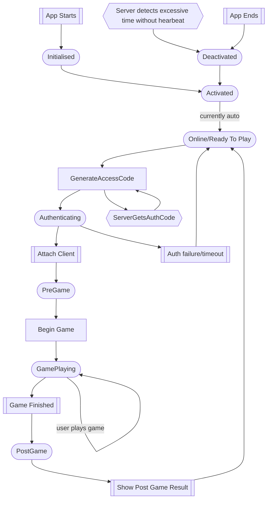
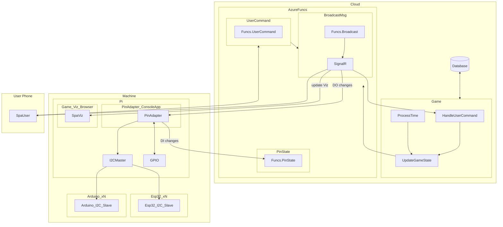
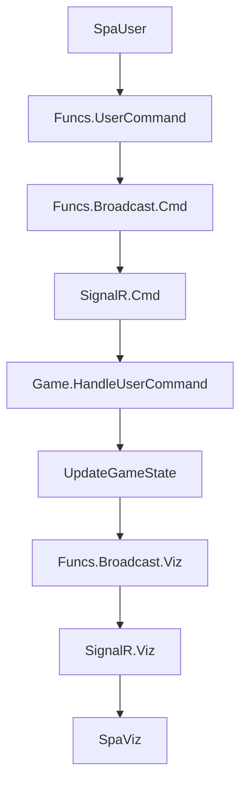
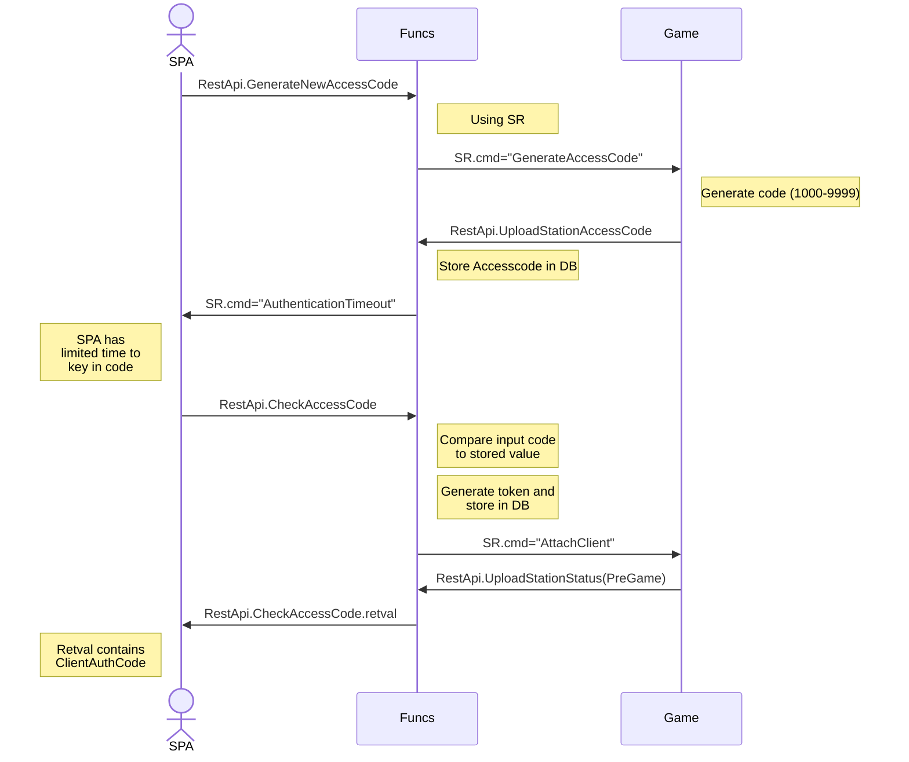

# GameState

# Hardware Architecture

## Sending User Command

Since no object has direct access to the SignalR Hub and it's clients directly, all traffic has to go through the AzureFuns functions. The first Funcs API handles the user command, and broadcasts it to all clients, one of which is the Game, which recognises that this message is for the game. It processes the message and produced a new game state, which is also sent to all SignalR clients via the Azure Funcs API. This "update viz" message is handled by the GameViz on the Pi.

All messages are send to all clients, even the messages that originated on that client. Messages contain routing information to allow clients to determine if this message is meant for them. Everything else is ignored.

### Senders and Recipients

#### SPA

Uses Funcs.PassCommandToStation to send commands from the game

| Sender  | Direction   |Command            | Purpose
| ------- | -------     |-------            |-------            
| GameId  | SPA2Station | GenerateAccessCode|  (1)
| GameId  | Station2SPA | AuthenticationTimeout| (2)
| GameId  | SPA2Station | AttachClient      |  (3)
| ClientId  | SPA2Station | AttachClient      | (4)
| PinStatePost  | DEV2DB | PinStateChange      |  (5)
| PinStatePost  | DB2DEV | PinStateChange      |  (6)

1) Ask Game to generate access code and upload the DB.
2) Tell SPA that access code is geenrated and will expire in Timeout
3) Successful access code, "attach" game to client
4) Uses Funcs.PassCommandToStation to send commands from the game UI
5) PinAdapter just uploaded new pin states to DB
6) DB just uploaded new pin states for PinAdapter to read

Funcs.BroadcastMessageToSignalRClients, post 
ClientMessage msg = JsonConvert.DeserializeObject<ClientMessage>(content);

VisualisationRestAPI.PublishVisualisationData(VisualisationData vd)
ClientMessage cm = new ClientMessage();
      cm.Sender = "Station";
      cm.StationId = "StationId";
      cm.Direction = "Station2Viz";
      cm.AccessToken = "";
      cm.Command = "UpdateViz";
      cm.Parameters = vd.Serialize;

maybe rename 

PassCommandToStation to PassMessageToStation

PublishMessageToClient to PassMessageToClient

## GenerateAccessCode

